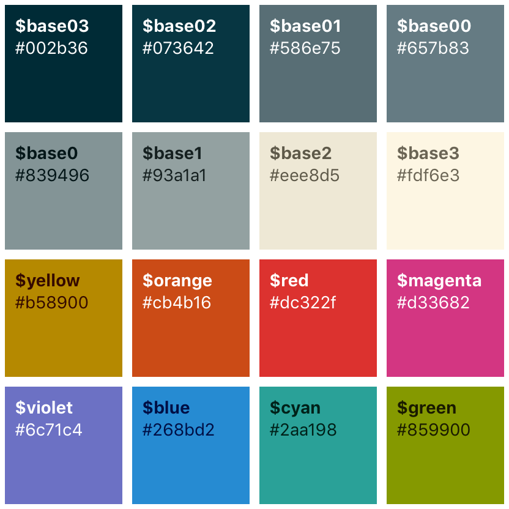

## Sketch App Solarized Color Palette

This is the [Sketch App](https://www.sketchapp.com/) Color Palette for [Solarized](http://ethanschoonover.com/solarized), a sixteen color palette designed for use with terminal and gui applications created by Ethan Schoonover.

* Tested on Sketch App v43.2

``` json
{
  "$base03": "#002b36",
  "$base02": "#073642",
  "$base01": "#586e75",
  "$base00": "#657b83",
  "$base0": "#839496",
  "$base1": "#93a1a1",
  "$base2": "#eee8d5",
  "$base3": "#fdf6e3",
  "$yellow": "#b58900",
  "$orange": "#cb4b16",
  "$red": "#dc322f",
  "$magenta": "#d33682",
  "$violet": "#6c71c4",
  "$blue": "#268bd2",
  "$cyan": "#2aa198",
  "$green": "#859900"
}
```



### Contributing

1. Fork it https://github.com/FlutterCodes/sketch-app-solarized-color-palett/fork
2. Create your feature branch `git checkout -b my-new-change`
3. Commit your changes `git commit -am 'Add some change'`
4. Push to the branch `git push origin my-new-change`
5. Create a new Pull Request

### License

The MIT License (MIT)

Copyright (c) 2017 Flutter Codes

Permission is hereby granted, free of charge, to any person obtaining a copy of this software and associated documentation files (the "Software"), to deal in the Software without restriction, including without limitation the rights to use, copy, modify, merge, publish, distribute, sublicense, and/or sell copies of the Software, and to permit persons to whom the Software is furnished to do so, subject to the following conditions:

The above copyright notice and this permission notice shall be included in all copies or substantial portions of the Software.

THE SOFTWARE IS PROVIDED "AS IS", WITHOUT WARRANTY OF ANY KIND, EXPRESS OR IMPLIED, INCLUDING BUT NOT LIMITED TO THE WARRANTIES OF MERCHANTABILITY, FITNESS FOR A PARTICULAR PURPOSE AND NONINFRINGEMENT. IN NO EVENT SHALL THE AUTHORS OR COPYRIGHT HOLDERS BE LIABLE FOR ANY CLAIM, DAMAGES OR OTHER LIABILITY, WHETHER IN AN ACTION OF CONTRACT, TORT OR OTHERWISE, ARISING FROM, OUT OF OR IN CONNECTION WITH THE SOFTWARE OR THE USE OR OTHER DEALINGS IN THE SOFTWARE.